# Deploy Static Website

## [Github Pages](https://pages.github.com)
---

### Github - Create a new repository link

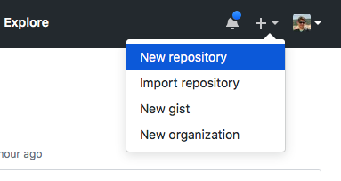

### Github - Create a new repository page

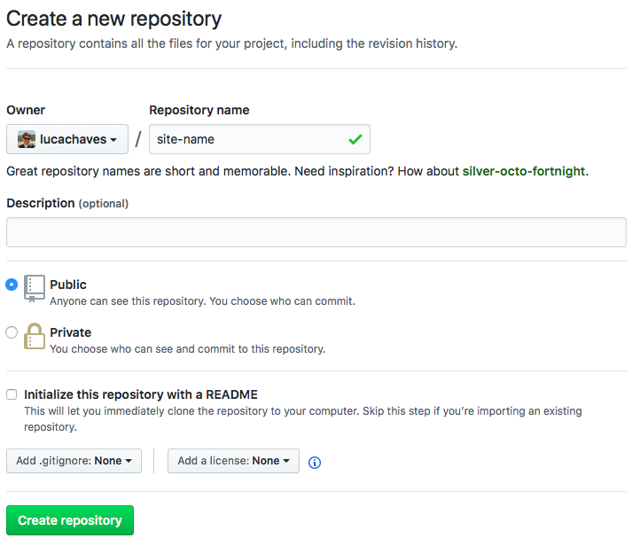

### Github - Repository page

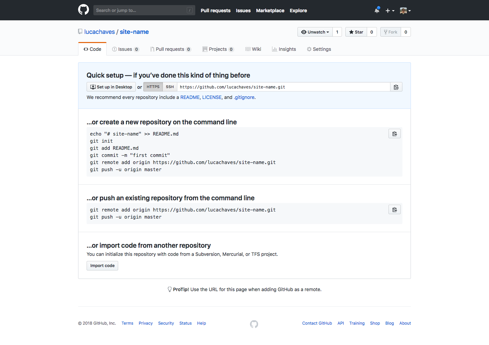

### Desktop - Install git

> https://git-scm.com/downloads

```
# apt-get install git
```

### Desktop - Create site folder

```
$ mkdir site-name
```

### VSCode - Open folder

> Go to File > Menu > Open folder

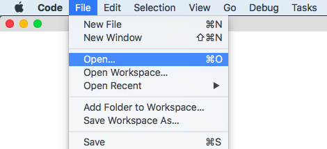

### VSCode - Initialize Git Repository

```
$ git init
```

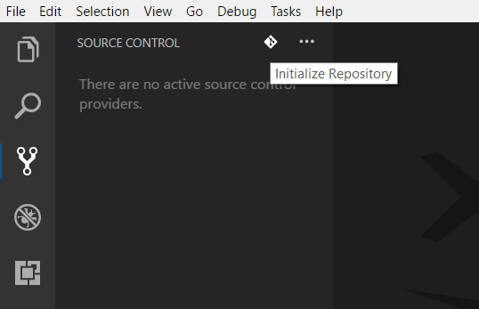

### VSCode - Create site

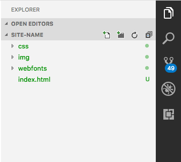

### VSCode - Git add

```
$ git add -A
```

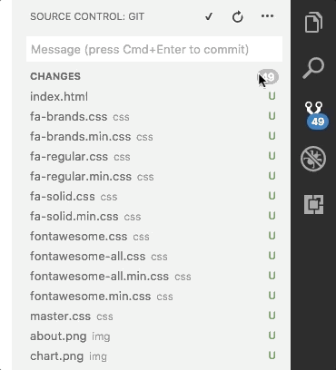

### VSCode - Git commit

```
$ git commit -m "primeira versão do site"
```

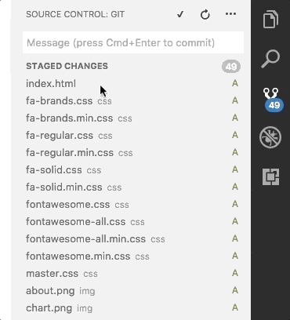

### VSCode - Git remote add

```
$ git remote add origin https://github.com/lucachaves/site-name.git
```

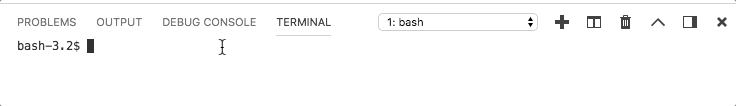

### VSCode - Git remote add

```
$ git push -u origin master
```


### Github - Repository page with code

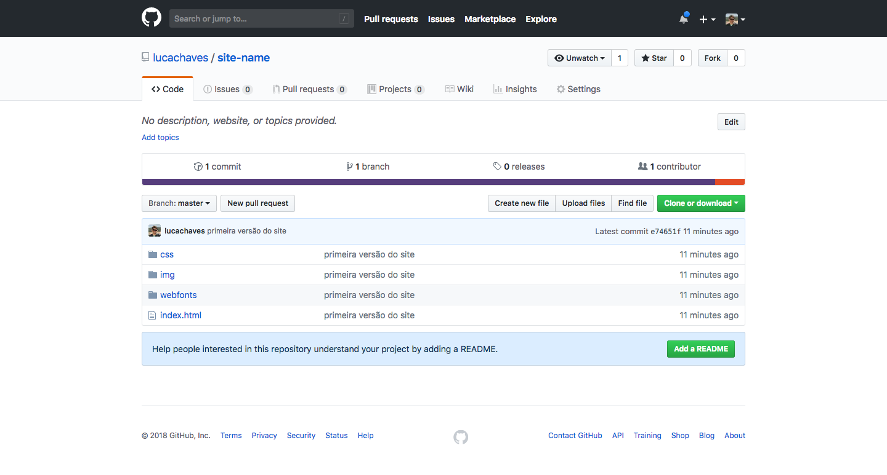

### Github - Create github page

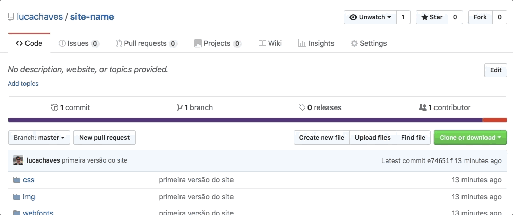


### Browser - open https://lucachaves.github.io/site-name/

## Netlify
---

[Como colocar seu site no ar de graca](https://willianjusten.com.br/como-colocar-seu-site-no-ar-de-graca/)